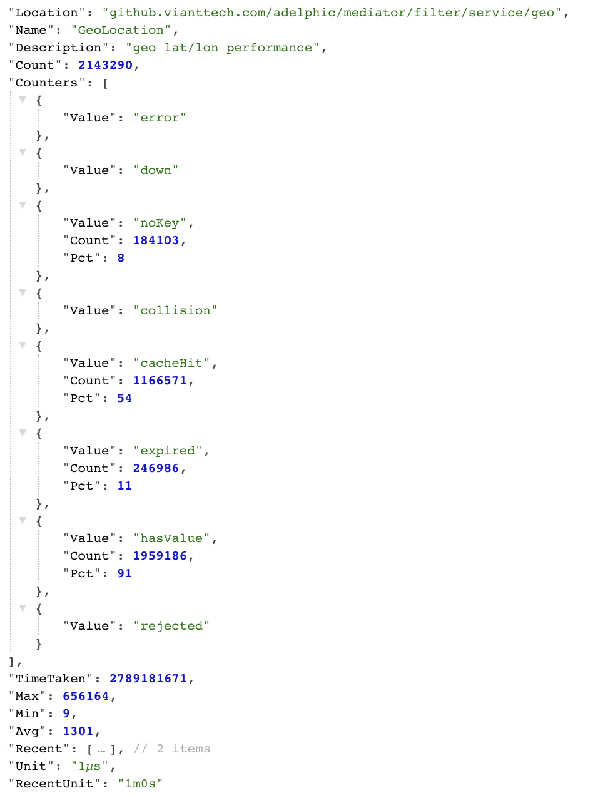

# Application operation performance metric (gmetric)


[](https://goreportcard.com/report/github.com/viant/gmetric)
[](https://godoc.org/github.com/viant/gmetric)

This library is compatible with Go 1.12+

Please refer to [`CHANGELOG.md`](CHANGELOG.md) if you encounter breaking changes.

- [Motivation](#motivation)
- [Usage](#usage)
- [License](#license)
- [Credits and Acknowledgements](#credits-and-acknowledgements)


## Motivation

The goal of this project is to provide metrics to measure various aspect of the application behaviours with minimum overhead.  
Application metrics can be viewed as cumulative or recent rolling window values.
All metrics are locking and memory allocation free to provide best possible performance.


## Usage


##### Single metric counter


```go

package mypackage

import (
	"errors"
	"github.com/viant/gmetric"
	"github.com/viant/gmetric/stat"
	"log"
	"math/rand"
	"net/http"
	"testing"
	"time"
)

func OperationCounterUsage() {

	metrics := gmetric.New()
	handler := gmetric.NewHandler("/v1/metrics", metrics)
	http.Handle("/v1/metrics", handler)

	//basic single counter
	counter := metrics.OperationCounter("pkg.myapp", "mySingleCounter1", "my description", time.Microsecond, time.Minute, 2)
	go runBasicTasks(counter)

	err := http.ListenAndServe(":8080", http.DefaultServeMux)
	if err != nil {
		log.Fatal(err)
	}
}

func runBasicTasks(counter *gmetric.Operation) {
	for i := 0; i < 1000; i++ {
		runBasicTask(counter)
	}
}

func runBasicTask(counter *gmetric.Operation) {
	onDone := counter.Begin(time.Now())
	defer func() {
		onDone(time.Now())
	}()
	time.Sleep(time.Nanosecond)

}

```

```bash
open http://127.0.0.1:8080/v1/metrics/counters
## or 
open http://127.0.0.1:8080/v1/metrics/counter/mySingleCounter1
```

##### Multi metric counter


```go
package gmetric_test

import (
	"errors"
	"github.com/viant/gmetric"
	"github.com/viant/gmetric/counter/base"
	"github.com/viant/gmetric/stat"
	"log"
	"math/rand"
	"net/http"
	"testing"
	"time"
)


const (
	NoSuchKey       = "noSuchKey"
	MyStatsCacheHit       = "cacheHit"
	MyStatsCacheCollision = "cacheCollision"
)


//MultiStateStatTestProvider represents multi stats value provider
type MultiStateStatTestProvider struct{ *base.Provider }

//Map maps value int slice index
func (p *MultiStateStatTestProvider) Map(key interface{}) int {
	textKey, ok := key.(string)
	if !ok {
		return p.Provider.Map(key)
	}
	switch textKey {
	case NoSuchKey:
		return 1
	case MyStatsCacheHit:
		return 2
	case MyStatsCacheCollision:
		return 3
	}
	return -1
}


func OperationMulriCounterUsage() {
	metrics := gmetric.New()
	handler := gmetric.NewHandler("/v1/metrics", metrics)
	http.Handle("/v1/metrics", handler)
	counter := metrics.MultiOperationCounter("pkg.myapp", "myMultiCounter1", "my description", time.Microsecond, time.Minute, 2, &MultiStateStatTestProvider{})
	go runMultiStateTasks(counter)

	err := http.ListenAndServe(":8080", http.DefaultServeMux)
	if err != nil {
		log.Fatal(err)
	}
}

func runMultiStateTasks(counter *gmetric.Operation) {
	for i := 0; i < 1000; i++ {
		runMultiStateTask(counter)
	}

}

func runMultiStateTask(counter *gmetric.Operation) {
	stats := stat.New()
	onDone := counter.Begin(time.Now())
	defer func() {
		onDone(time.Now(), stats)
	}()

	time.Sleep(time.Nanosecond)
	//simulate task metrics state
	rnd := rand.NewSource(time.Now().UnixNano())
	state := rnd.Int63() % 3
	switch state {
		case 0:
			stats.Append(NoSuchKey)
		case 1:
			stats.Append(MyStatsCacheHit)
		case 2:
			stats.Append(MyStatsCacheHit)
			stats.Append(MyStatsCacheCollision)
	}
	if rnd.Int63() % 10 == 0 {
		stats.Append(errors.New("test error"))
	}
}
```

```bash

### all operations counters
open http://127.0.0.1:8080/v1/metrics/operations


## indivual operation multi counter
open http://127.0.0.1:8080/v1/metrics/operations/myMultiCounter1


## cumulative indivual operation multi counter metric value

open http://127.0.0.1:8080/v1/metrics/operations/myMultiCounter1/cumulative/count
open http://127.0.0.1:8080/v1/metrics/operations/myMultiCounter1/cumulative/min
open http://127.0.0.1:8080/v1/metrics/operations/myMultiCounter1/cumulative/avg
open http://127.0.0.1:8080/v1/metrics/operations/myMultiCounter1/cumulative/max
open http://127.0.0.1:8080/v1/metrics/operations/myMultiCounter1/cumulative/error
open http://127.0.0.1:8080/v1/metrics/operations/myMultiCounter1/cumulative/noSuchKey
open http://127.0.0.1:8080/v1/metrics/operations/myMultiCounter1/cumulative/cacheCollision


## recent counter 
open http://127.0.0.1:8080/v1/metrics/operations/myMultiCounter1/recent/count
open http://127.0.0.1:8080/v1/metrics/operations/myMultiCounter1/recent/min
open http://127.0.0.1:8080/v1/metrics/operations/myMultiCounter1/recent/avg
open http://127.0.0.1:8080/v1/metrics/operations/myMultiCounter1/recent/mx
open http://127.0.0.1:8080/v1/metrics/operations/myMultiCounter1/recent/counter
open http://127.0.0.1:8080/v1/metrics/operations/myMultiCounter1/recent/error
open http://127.0.0.1:8080/v1/metrics/operations/myMultiCounter1/recent/noSuchKey
open http://127.0.0.1:8080/v1/metrics/operations/myMultiCounter1/recent/cacheCollision
```


Example metric:




## License

The source code is made available under the terms of the Apache License, Version 2, as stated in the file `LICENSE`.

Individual files may be made available under their own specific license,
all compatible with Apache License, Version 2. Please see individual files for details.


##  Credits and Acknowledgements

**Library Author:** Adrian Witas

